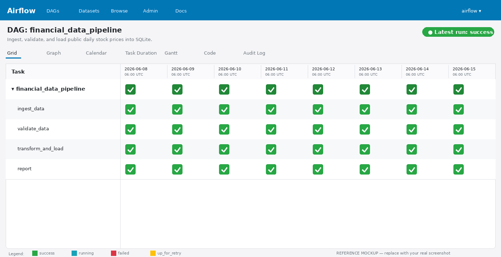

# Airflow Financial Data Pipeline

An end-to-end **Apache Airflow** pipeline that ingests publicly available
daily stock-price data, runs a battery of data-quality checks, and loads the
validated rows into a local **SQLite** database.

The whole stack runs on a laptop with `docker compose up`.

---

## What the pipeline does

```
 ┌──────────────┐    ┌────────────────┐    ┌──────────────────────┐    ┌────────┐
 │  ingest_data │ →  │ validate_data  │ →  │ transform_and_load   │ →  │ report │
 │  yfinance →  │    │ 8 distinct DQ  │    │ adds daily_return,   │    │ logs a │
 │  staging.csv │    │ checks; raises │    │ upserts to SQLite    │    │ summary│
 │              │    │ on any failure │    │ (daily_prices)       │    │        │
 └──────────────┘    └────────────────┘    └──────────────────────┘    └────────┘
```

* **Data source.** [`yfinance`](https://pypi.org/project/yfinance/) (Yahoo
  Finance) for the configurable ticker list `AAPL,MSFT,GOOG,SPY`. If yfinance
  is unreachable the ingest task automatically falls back to the public
  [Stooq](https://stooq.com) CSV endpoint, so the pipeline still runs offline
  on home networks that block Yahoo.
* **Staging.** A timestamped CSV under `./data/staging_<run_id>.csv`.
* **Target store.** SQLite, `./data/financial.db`, table `daily_prices` with
  primary key `(ticker, date)`.

### Validation checks (8 total)

| # | Check | What it catches |
|---|-------|-----------------|
| 1 | `required_columns_present` | Missing schema columns |
| 2 | `non_empty` | Empty ingest result |
| 3 | `no_missing_in_key_columns` | Nulls in `ticker` / `date` / `close` |
| 4 | `numeric_dtypes` | Prices/volume that aren't numeric |
| 5 | `positive_prices_and_nonneg_volume` | Negative / zero prices, negative volume |
| 6 | `high_low_consistency` | Rows where `low > high` or `o/c` outside `[low, high]` |
| 7 | `date_parsable` | Unparsable date strings |
| 8 | `no_duplicate_rows` | Duplicate `(ticker, date)` rows |

Any failing check raises `ValidationError`, which fails the `validate_data`
task and — because Airflow's default trigger rule is `all_success` — short-circuits
the downstream load and report tasks.

> The task spec only requires *two* distinct checks; we ship eight so reviewers
> can see real-world DQ logic.

---

## Repository layout

```
.
├── dags/
│   └── financial_data_pipeline.py     # the DAG (and a 2nd "invalid demo" DAG)
├── scripts/
│   ├── ingest.py                      # yfinance / stooq → CSV
│   ├── validate.py                    # 8 DQ checks
│   └── transform_load.py              # CSV → SQLite (daily_prices)
├── tests/
│   └── test_validation.py             # 9 pytest unit tests
├── data/                              # staging CSV + SQLite db live here at runtime
├── logs/  plugins/  config/           # Airflow runtime dirs (gitignored content)
├── docs/
│   └── airflow_success.png            # reference Grid View mockup — replace after your run
├── docker-compose.yaml                # LocalExecutor + Postgres + webserver + scheduler
├── requirements.txt                   # runtime deps for the DAG callables
├── .env.example                       # copy to .env before first start
└── README.md                          # this file
```

---

## Prerequisites

* Docker Desktop / Docker Engine **20.10+** with the Compose plugin
* At least **4 GB RAM** allocated to Docker (Airflow's recommended floor)
* Ports `8080` (Airflow UI) and `5432` (Postgres) free

You do *not* need to install Airflow on the host — it runs in containers.

---

## Quick start (Docker Compose)

```bash
# 1. clone
git clone <your-fork-url> airflow-financial-pipeline
cd airflow-financial-pipeline

# 2. create the .env file
cp .env.example .env
# on Linux, also set your UID so logs are owned by you:
echo "AIRFLOW_UID=$(id -u)" >> .env

# 3. one-time DB migration + admin user creation
docker compose up airflow-init

# 4. start the stack
docker compose up -d

# 5. open the UI
#    URL:  http://localhost:8080
#    user: airflow
#    pass: airflow
```

The first boot takes a couple of minutes — the official Airflow image
pip-installs `pandas`, `requests`, and `yfinance` on startup via
`_PIP_ADDITIONAL_REQUIREMENTS` (see `docker-compose.yaml`). Subsequent boots
are fast.

### Trigger the pipeline

1. Open <http://localhost:8080>.
2. Unpause the **`financial_data_pipeline`** toggle.
3. Click **Trigger DAG ▸** to run it now (otherwise it will run on the next
   weekday at 06:00 UTC).
4. Click into the run and watch all four tasks turn dark green.

After a successful run you should see:

```bash
ls -lh data/
# staging_manual__2026-06-15T...csv
# financial.db

sqlite3 data/financial.db 'SELECT ticker, COUNT(*) FROM daily_prices GROUP BY ticker;'
# AAPL|252
# GOOG|252
# MSFT|252
# SPY|252
```

### Demonstrate a failing run

A second DAG, **`financial_data_pipeline_invalid_demo`**, generates a
deliberately broken staging file (nulls, negative prices, low > high,
duplicates) so reviewers can confirm that the validation step actually fails
the run:

1. Unpause `financial_data_pipeline_invalid_demo` in the UI.
2. Trigger it manually.
3. `make_bad_data` → green, `validate_data` → **red**, `transform_and_load_should_not_run` → grey/upstream-failed.
4. Open the failed task's log — you'll see the list of failing checks, e.g.:

```
ValidationError: Validation failed for /opt/airflow/data/staging_INVALID_*.csv.
Failing checks: ['no_missing_in_key_columns',
                 'positive_prices_and_nonneg_volume',
                 'high_low_consistency',
                 'date_parsable',
                 'no_duplicate_rows']
```

---

## Successful DAG run — Airflow UI screenshot

> **Note for reviewers / submitter:** the image below is a *reference mockup*
> shipped with the repo so the README renders out of the box. After you run
> the pipeline locally, please replace `docs/airflow_success.png` with a real
> screenshot of the Airflow Grid View showing your successful run.



### How to capture and add your own screenshot

1. Trigger `financial_data_pipeline` and wait for all four task instances to
   go green.
2. While still on the DAG page, take a screenshot of the **Grid** tab so
   reviewers can see every task succeeded:
   - macOS: `Cmd + Shift + 4`, then drag over the browser viewport.
   - Linux: `gnome-screenshot -a` (or your distro's screenshot tool).
   - Windows: `Win + Shift + S`.
3. Save it as `docs/airflow_success.png` (overwrite the reference mockup).
4. Commit:

```bash
git add docs/airflow_success.png
git commit -m "docs: add screenshot of successful DAG run"
git push
```

The image will then render here automatically.

---

## Configuration

| Environment variable | Default | What it does |
|----------------------|---------|--------------|
| `AIRFLOW_TICKERS` | `AAPL,MSFT,GOOG,SPY` | Comma-separated tickers to ingest. Set this in `.env` and `docker compose up -d` again. |
| `AIRFLOW_UID` | `50000` | Host UID Airflow runs as. Set to your `id -u` on Linux. |
| `_AIRFLOW_WWW_USER_USERNAME` | `airflow` | Initial admin username. |
| `_AIRFLOW_WWW_USER_PASSWORD` | `airflow` | Initial admin password. **Change this** if you expose port 8080. |

To change tickers without a rebuild:

```bash
echo 'AIRFLOW_TICKERS=NVDA,AMD,TSLA,SPY' >> .env
docker compose up -d --force-recreate airflow-scheduler airflow-webserver
```

---

## Running the unit tests

The validation logic has its own pytest suite that runs offline (no Airflow,
no network):

```bash
python -m venv .venv && source .venv/bin/activate
pip install -r requirements.txt
pytest -q
# 9 passed in 0.8s
```

---

## Troubleshooting

| Symptom | Fix |
|---------|-----|
| `airflow-init` exits non-zero on first run | Re-run `docker compose down -v && docker compose up airflow-init`. Make sure `.env` exists. |
| Tasks fail with `ModuleNotFoundError: yfinance` | The image is still installing deps. Watch `docker compose logs airflow-scheduler` and wait for `Successfully installed yfinance-...`. |
| `data/` directory is owned by root on Linux | Set `AIRFLOW_UID=$(id -u)` in `.env` and `docker compose down && up`. |
| Yahoo blocks the container's IP | The ingest task automatically falls back to Stooq — the run should still succeed. |
| Port 8080 already in use | Edit the `ports:` block in `docker-compose.yaml`, e.g. `"8088:8080"`. |

---

## Stopping and cleaning up

```bash
docker compose down              # stop containers, keep DB volume
docker compose down -v           # also delete Postgres metadata
rm -rf data/staging_*.csv data/financial.db   # delete pipeline outputs
```

---

## License

MIT (see `LICENSE` if you add one — left out of the scaffold).
