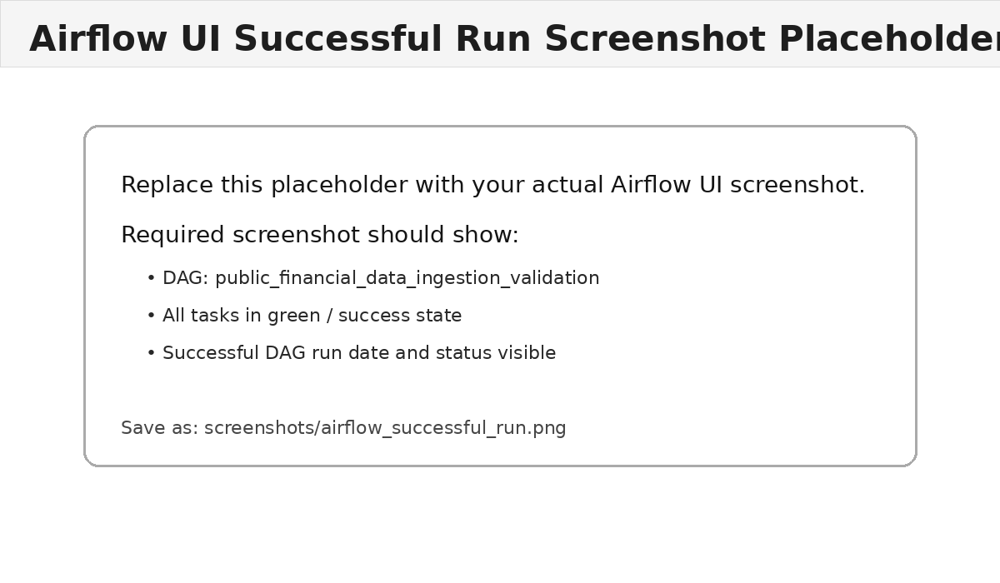

# Public Financial Data Ingestion and Validation with Apache Airflow

This project implements a local Apache Airflow workflow that ingests public financial market data, validates the staged dataset, and loads valid rows into a local SQLite target table.

## Dataset

- **Source:** Stooq public daily historical stock data CSV
- **Symbol used:** `aapl.us` / Apple daily OHLCV prices
- **Source URL:** `https://stooq.com/q/d/l/?s=aapl.us&i=d`
- **Data fields:** `Date`, `Open`, `High`, `Low`, `Close`, `Volume`

Stooq provides downloadable historical market data in CSV format, which makes it suitable for programmatic ingestion without API credentials.

## Repository Structure

```text
airflow_financial_data_pipeline/
├── dags/
│   └── financial_data_ingestion_dag.py
├── src/
│   └── finance_pipeline.py
├── tests/
│   └── test_validation.py
├── screenshots/
│   └── airflow_successful_run_placeholder.png
├── data/
│   └── .gitkeep
├── logs/
│   └── .gitkeep
├── plugins/
│   └── .gitkeep
├── config/
│   └── .gitkeep
├── docker-compose.yml
├── requirements.txt
├── task_comment.md
└── README.md
```

## DAG Overview

DAG ID: `public_financial_data_ingestion_validation`

The DAG contains three main tasks:

| Task ID | Purpose |
|---|---|
| `ingest_public_financial_data` | Downloads Stooq daily OHLCV CSV data into `/opt/airflow/data/staging_aapl_daily.csv`. |
| `validate_staged_financial_data` | Runs validation checks. The task raises `ValueError` if any check fails, causing the DAG run to fail. |
| `transform_and_load_to_sqlite` | Adds derived fields and loads valid data into `/opt/airflow/data/finance_warehouse.db`. |

## Validation Checks

The validation layer includes more than two checks. Key checks include:

1. Required columns exist: `date`, `open`, `high`, `low`, `close`, `volume`.
2. Required fields do not contain missing values.
3. Date values are parseable and not duplicated.
4. Numeric fields are type-consistent.
5. Prices are strictly positive.
6. Volume is non-negative.
7. `high >= low`.
8. `open` and `close` are between `low` and `high`.
9. The dataset has at least 100 rows.

If any validation fails, the validation task raises an exception and the DAG run is marked failed.

## Target Store

Valid rows are transformed and loaded into SQLite:

```text
/opt/airflow/data/finance_warehouse.db
```

Target table:

```sql
stock_prices_daily
```

Derived columns added during transformation:

- `symbol`
- `daily_return`
- `dollar_volume`
- `loaded_at_utc`

## Local Setup Instructions

### 1. Clone the repository

```bash
git clone <your-github-repo-url>
cd airflow_financial_data_pipeline
```

### 2. Create required folders

```bash
mkdir -p dags logs plugins config data screenshots
```

### 3. Set Airflow UID

Linux/macOS:

```bash
echo -e "AIRFLOW_UID=$(id -u)" > .env
```

Windows PowerShell:

```powershell
"AIRFLOW_UID=50000" | Out-File -Encoding ascii .env
```

### 4. Start Airflow

```bash
docker compose up airflow-init
docker compose up -d
```

Airflow UI will be available at:

```text
http://localhost:8080
```

Default login:

```text
Username: airflow
Password: airflow
```

### 5. Run the DAG successfully

In the Airflow UI:

1. Open DAG `public_financial_data_ingestion_validation`.
2. Unpause the DAG.
3. Click **Trigger DAG**.
4. Confirm all three tasks complete successfully.

You can also trigger from CLI:

```bash
docker compose exec airflow-scheduler airflow dags trigger public_financial_data_ingestion_validation
```

### 6. Test validation failure behavior

Trigger the DAG with invalid data simulation enabled:

```bash
docker compose exec airflow-scheduler airflow dags trigger \
  public_financial_data_ingestion_validation \
  --conf '{"simulate_invalid": true}'
```

Expected result:

- `ingest_public_financial_data` succeeds.
- `validate_staged_financial_data` fails.
- `transform_and_load_to_sqlite` does not run.

This demonstrates that validation failure is reflected in the DAG status.

## Verify SQLite Output

After a successful run:

```bash
docker compose exec airflow-scheduler python - <<'PY'
import sqlite3
conn = sqlite3.connect('/opt/airflow/data/finance_warehouse.db')
print(conn.execute('SELECT COUNT(*) FROM stock_prices_daily').fetchone())
print(conn.execute('SELECT * FROM stock_prices_daily LIMIT 5').fetchall())
conn.close()
PY
```

## Run Unit Tests Locally

```bash
python -m venv .venv
source .venv/bin/activate   # Windows: .venv\Scripts\activate
pip install -r requirements.txt
pytest -q
```

## Airflow UI Screenshot

Add your actual screenshot after running the DAG successfully:

```text
screenshots/airflow_successful_run.png
```

Current placeholder:



Replace the placeholder with a real Airflow UI screenshot showing the DAG run in success state before final submission.

## Notes

- The DAG uses `PythonOperator` for ingestion, validation, and load tasks.
- The data source is public and requires no API key.
- The SQLite database and staged files are written to the local `data/` folder, which is ignored by Git except for `.gitkeep`.
- For a production pipeline, replace SQLite with a managed warehouse and add alerting, lineage, retry policies, and data quality reporting.
